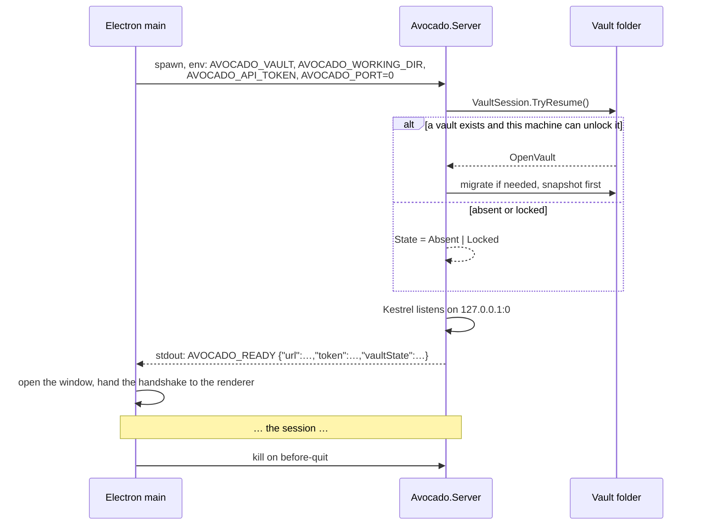
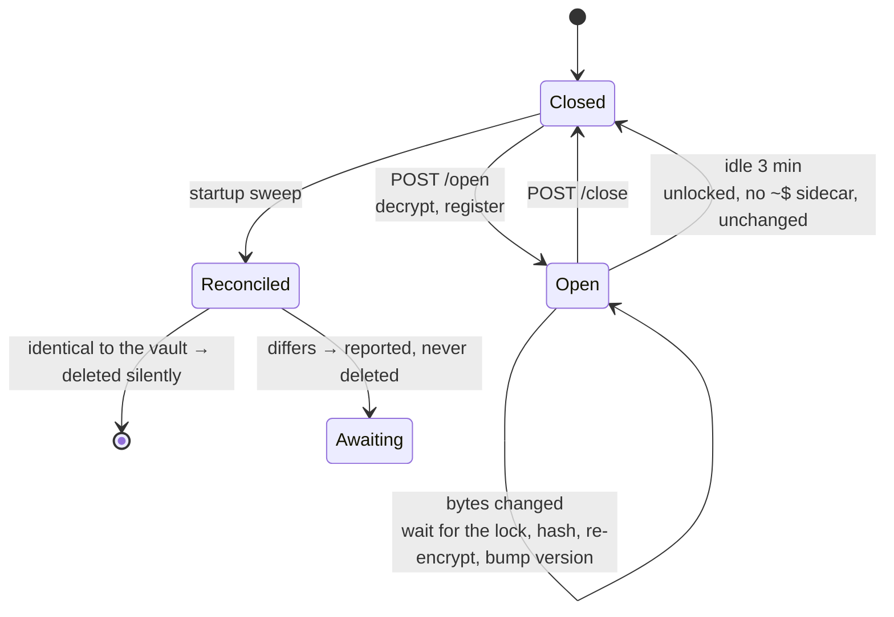

# The backend

`src/Avocado.Server` is an ASP.NET Core Minimal API on .NET 10. It is not a server anyone deploys: it
is a process the desktop shell starts and stops, listening on loopback on a port the OS picks.

`src/Avocado.Vault` is the library underneath it that owns everything to do with encryption.
`src/Avocado.Cli` is a small tool that operates on a vault without a window.

---

## Building and running

```bash
dotnet build                               # everything
dotnet test                                # the vault's 99 tests
dotnet run --project src/Avocado.Server    # the service on its own, no window
```

Run on its own it reads three environment variables:

| Variable | Default | What it is |
|---|---|---|
| `AVOCADO_VAULT` | `~/Documents/Avocado` | The vault folder |
| `AVOCADO_WORKING_DIR` | `%LOCALAPPDATA%/Avocado/working` | Where documents are decrypted while open |
| `AVOCADO_API_TOKEN` | random per launch | The bearer token every request must carry |
| `AVOCADO_PORT` | `0`, the OS picks | Useful when you want a stable port to `curl` |

```bash
AVOCADO_API_TOKEN=diag AVOCADO_PORT=45999 dotnet run --project src/Avocado.Server
curl -s -H "Authorization: Bearer diag" http://127.0.0.1:45999/api/dashboard | jq
```

### Publishing

Executables publish **self-contained and single-file**, because a lawyer installing Avocado must never
be told to install a .NET runtime first:

```bash
dotnet publish src/Avocado.Server -c Release -r win-x64
```

That behaviour lives in `Directory.Build.targets`, **not** `.props`. MSBuild imports `.props` before
the project body, where `OutputType` has not been set yet, so the condition would silently never match
and the publish would quietly come out framework-dependent. Supported RIDs are in
`.github/workflows/ci.yml`: `win-x64`, `win-arm64`, `linux-x64`, `linux-arm64`, `osx-x64`, `osx-arm64`.

### Importing a Gestisoft export

The same import as Réglages, without the window, for a practice with four hundred dossiers that would
rather start it and go home:

```bash
Avocado.Server --import "D:\AVOCAT\Dossiers clients" --vault "C:\Users\me\Documents\Avocado"
```

`--templates` writes the two spreadsheets and stops. `--dossier "D:\...\CLASSES\CHANTERACOISE"` says
that one folder is a dossier, repeatable, and given none the scan's own suggestions run.
`--archived ARCHIVES` says which folder names mean finished work, repeatable, defaulting to CLASSES and
the handful of words people actually use. `--vault` defaults to `AVOCADO_VAULT`, then to
`~/Documents/Avocado`.

It runs migrations first, since the window normally does that at startup and a vault made by
`avocado create` has no tables until it happens.

**It is on the server binary, not on `avocado`.** `Avocado.Cli` is deliberately held to the vault
library alone, so `avocado backup` still works on the day the application does not. Importing needs EF
Core, MsgReader and the whole Documents slice; the server executable already carries all of it and
already ships beside the app.

### Which folders are dossiers

**She says.** The scan reads the whole tree, marks what it would have chosen, and the marks are a
starting point. Marking a folder makes it one dossier holding everything beneath it, so choosing the
children instead of the parent is the split and choosing nothing leaves it out. Those two gestures
replaced a pair of controls that did the same job worse.

The suggestion is still the same rule and it is still right about most of a real export: a dossier is
the folder whose children are its own filing. `01 Courriers` appears 37 times, `02 Actes` 24, while 606
of the 728 distinct folder names occur exactly once. Two leading digits and not one, because
`01 Courriers` is a drawer and `2 RIDE` is a client; a name that is nothing but digits is not filing
either, since `700770` is Gestisoft's number for the dossier itself.

**Where it is wrong it is wrong invisibly, which is why it stopped deciding.** CHANTERACOISE keeps CA,
MED and Tcom. None of those reads as filing, so the scan walked past it and offered the leaves:
« Assignation et nos conclusions » with three documents and « Conclusions adv » with two, five bogus
dossiers where there is one affaire. Nothing on screen said whose they were. Worse, the six files
sitting loose in CHANTERACOISE belonged to no candidate at all, and would have been dropped without a
word: **81 files across the real export**, which is why the count of what no chosen dossier takes is
now on screen and in the CLI's output.

The folder she points at is itself a row, and markable. Pointing at one dossier to import just that one
is a thing people do, and files lying loose in it were otherwise counted nowhere.

**Archived is a property of the path.** A dossier anywhere under a folder named in `--archived` is
closed. On the real export the suggestion gives 101 dossiers, 21 open and 80 closed, from a tree of
1 071 folders.

### What the export does and does not contain

Folders, mostly. No dates, and contacts and billing only where Gestisoft agreed to export them,
which on the real export is 7 dossiers out of 101. So:

- Dossiers are dated **from their correspondence**, not from the filesystem. The export stamps every
  file with the moment it ran, so file times would put a decade of history on one afternoon; the
  emails carry the dates they were really sent.
- `.msg` and `.eml` become journal entries with their attachments filed as pièces of their own.
- Where a **`Liste des contacts` PDF** sits beside the dossier, every party is read from it with the
  role Gestisoft gave it: client, interlocuteur, partie adverse, both sides' avocats, the juridiction.
  Otherwise the client is a contact named after the folder, unless `avocado-tiers.csv` names a real
  one.
- Where an **`export.xlsx`** sits beside it, the factures and règlements are read from it. Otherwise
  billing stays empty unless `avocado-facturation.csv` says otherwise. An invented total is worse than
  an absent one, because it looks like a fact.
- Gestisoft's own number for the dossier becomes its référence, so every facture and email she has
  already sent still matches.

Both files are found by score rather than by name: how the file name begins and whether it sits in a
folder about contacts or facturation. Matching any PDF mentioning contacts picked a letter called
*« pas de contact connu chez EDF OA »* over the real list two folders away, and matching any
spreadsheet claimed fourteen billing exports where seven exist.

**A règlement is never recorded twice.** Gestisoft prints a facture and the payment settling it as two
rows sharing a *pointage*: the payment settles the facture, and only a payment belonging to no facture
becomes a ledger movement. Whether a facture is paid comes from its own *solde*, so one invoiced at
7 581 € and part paid at 5 000 € stays open for the 2 581 € still owed.

The two spreadsheets are semicolon-separated UTF-8 with a BOM, which is what a French Excel reads and
writes without asking anything. Amounts are accepted in every shape it produces, `1 234,56 €`
included, with the non-breaking space it uses for thousands. A row that cannot be read is named and
the rest are kept.

### Globalization is invariant, and it is not only about formatting

`Directory.Build.props` sets `InvariantGlobalization`. Two consequences that both shipped as bugs:

- `CultureInfo.GetCultureInfo("fr-FR")` **throws**, it does not fall back to the invariant culture.
  Every template merge was doing exactly that. French dates and amounts are written out by hand in
  `TemplateFields` instead.
- `string.Normalize(NormalizationForm.FormD)` is a **no-op**. Folding accents by decomposing and
  dropping combining marks silently stops working, so `Débit` never matched `debit` and every accented
  money column in the billing export read as zero, without throwing or logging anything.

Neither shows up on a development machine with a French locale. Both are pinned by tests, which run
under the same setting.

---

### Cutting a version

Releasing is a button, not a tag pushed from a laptop. **Actions → CI → Run workflow**, choose what to
publish, and the run works out the number itself:

| Choice | From `v1.0.0-beta.3` | From `v1.2.3` |
|---|---|---|
| `beta` | `v1.0.0-beta.4` | `v1.2.4-beta.1` |
| `patch` | `v1.0.0`, the betas were leading here | `v1.2.4` |
| `minor` | `v1.1.0` | `v1.3.0` |
| `major` | `v2.0.0` | `v2.0.0` |

There is also a **Numéro imposé** field, which overrides the arithmetic. No sequence of bumps reaches
`v1.0.0-beta.1` from an empty repository, and it is the way out of a numbering mistake without
hand-tagging.

The tag is created **at the very end**, by the release job, once every platform has built. Not up
front, and that is not fussiness: a run whose Windows arm64 job died downloading an action, a 429 from
GitHub before a line of our code ran, left a tag behind naming a release that never happened and
consumed a version number nothing was published under. The tag and the release now appear together or
not at all.

That builds the six platforms, asserts each binary really bundled the runtime (a framework-dependent
publish looks fine right up until someone without .NET runs it), smoke tests the three the runners can
execute, and publishes the GitHub release from those same artifacts rather than from a second build.
One archive per platform holding the binary and the licence, named `avocado-cli-<tag>-<rid>`, plus
`SHA256SUMS` across everything attached.

In parallel, the `desktop` job builds what a lawyer actually installs: `Avocado.Server` published for
the target RID into `artifacts/backend`, then electron-builder over `app/`, producing an NSIS installer
and a zip on Windows, a `.dmg` and a zip on macOS, an AppImage and a tarball on Linux x64. Five
platforms, not six: cross-building an AppImage for `linux-arm64` needs emulation and breaks often, and
that user can run the CLI or build from source.

Those artifacts are named `Avocado-<os>-<arch>.<ext>` with **no version in the name**, deliberately.
The site's download buttons are plain links to `/releases/latest/download/Avocado-win-x64.exe`, which
only resolves if the name is identical in every release. Renaming them breaks every download button on
`site/`.

Nothing is signed. Windows SmartScreen and macOS Gatekeeper therefore object, and
`site/installation.html` walks users through it. Adding signing later is credentials in the environment
plus `identity` and `certificateFile` in `app/package.json`, not a different pipeline.

A beta is marked a pre-release on GitHub, which matters more than it looks:
`/releases/latest/download/` skips pre-releases, so the site keeps pointing at the last stable build
while a beta is out. That is the intended behaviour, and it only holds if the flag is right.

CI otherwise runs on pull requests, not on every push to `main`. A pull request runs the tests and
nothing else: the version job is skipped, and everything downstream needs it, so no runner spends
twenty minutes packaging installers for a change that is not being shipped.

From a terminal, if you prefer: `gh workflow run ci.yml -f bump=beta`.

---

## Lifecycle



Three things this shape buys, each of which was a bug first:

**The service starts even when there is no vault.** It has to: the setup wizard is served by it.
`VaultReadyMiddleware` answers `503` for everything except `/api/vault/*` and `/health` while the
vault is shut, and the renderer reads the state from `/api/vault/status` rather than inferring it from
a failure.

**The port is 0 and travels in the handshake.** A fixed port collides with whatever else the machine
is running. Note `Listen(IPAddress.Loopback, 0)` rather than `ListenLocalhost(0)`: the latter binds
both IPv4 and IPv6 and therefore rejects port 0 outright, since it cannot guarantee the same free port
on both.

**Logging goes to stdout and the shell forwards all of it.** The handshake is matched by marker
(`AVOCADO_READY `) rather than by reading the first line, and the reader stays open for the life of the
process. Closing it after the handshake, which it once did, silently discarded every log line from
then on, which makes anything that happens after startup impossible to diagnose from the window.

### Shutdown

`before-quit` kills the child. On Windows that is a hard terminate, so `IHostedService.StopAsync` may
not run. Everything that must survive that is written to be idempotent and reconciled at the next
launch, see `DocumentWorkspace`.

---

## The API

Routing lives in one `*Endpoints.cs` per slice and does nothing else; every handler is its own file.

```
GET    /health
GET    /api/vault/status              prepare · commit · discard · unlock · recovery-key
GET    /api/matters                   ?status=&search=&sort=&deadline=&clientId=&skip=&take=
POST   /api/matters                   PUT /{id} · /close · /reopen · /favourite · /parties
GET    /api/matters/{id}/activities   documents · deadlines · time-entries · billing
POST   /api/matters/{id}/invoices/from-time
GET    /api/invoices/{id}/detail.xlsx
POST   /api/documents/{id}/open       close · resolve · exhibit
GET    /api/documents/workspace
GET    /api/templates                 POST · PUT /{id} · /{id}/content
GET    /api/contacts                  PUT /{id} · /{id}/attachment
GET    /api/dashboard · /api/search · /api/deadlines · /api/settings
```

**Route templates must name the parameter the handler takes.** A mismatch does not fail at startup:
minimal APIs fall back to binding the value from the query string, find nothing, and answer `400` with
an empty body that says nothing at all. This cost an afternoon once.

Enums cross the wire as **names**, never integers, the front end owns the French labels and maps from
keys like `IncomingLetter`, so a renumbering here would silently relabel history.

Failures answer `ProblemDetails` in French, through `Hosting/FailureDetails.cs`. The framework's
default, *An error occurred while processing your request.*, is in English on a screen that is
otherwise entirely French, and says nothing about what to do. The case that actually happens, a file
held open by Word, is a `409` that says exactly that.

---

## Data access

`VaultDbContextFactory.Create(vaultId)` is the only way to get a `DbContext`. It resolves the vault
through `IVaultStore` and hands EF an already-keyed connection.

- **`Pooling=false`.** Microsoft.Data.Sqlite pools by connection string, and a pooled handle comes back
  already keyed; re-issuing `PRAGMA key` on it misbehaves, and in a multi-tenant build a handle keyed
  for one vault must never be reachable from another.
- **`contextOwnsConnection: true`**, since every context holds a real file handle.
- The package is **`Microsoft.EntityFrameworkCore.Sqlite.Core`**, never `…Sqlite`. The full package
  drags in `SQLitePCLRaw.bundle_e_sqlite3`, plain SQLite. Two bundles in one process means whichever
  registers first wins, and if that is `e_sqlite3` then `PRAGMA key` is a **no-op** and the whole
  practice is written in plaintext with no error at all. `VaultDatabase` asserts
  `PRAGMA cipher_version` at every open so a regression fails loudly.

### Migrations

```bash
dotnet ef migrations add <Name> --project src/Avocado.Server --output-dir Data/Migrations
```

`VaultMigrator` **takes a snapshot before migrating**, always, and names it in the failure message.
SQLite DDL is transactional, so a migration that *fails* rolls itself back; the dangerous case is one
that succeeds and is wrong, which nothing can undo. This is the user's only copy of their practice.

> **Adding a non-nullable column to a populated table needs a backfill in the same migration.**
> SQLite fills existing rows with the column's default, and EF's default for a string column is the
> empty string. Timestamps are stored as ISO-8601 text, so a `DateTimeOffset` column added without a
> backfill made every pre-existing row throw `String '' was not recognized as a valid DateTime` before
> a handler ever saw it. See `20260807071431_BackfillDocumentTimestamps`.

### Things EF will not do that this codebase works around

- **SQLite cannot `ORDER BY` a `DateTimeOffset`** through EF's default mapping. `UtcTimestampConverter`
  stores ISO-8601 UTC text, which sorts correctly as text and stays legible in a database viewer.
- **EF cannot translate an `ORDER BY` over a record built in a `Select`**, nor see through a helper
  method. Order the entity query *before* projecting, and inline the subqueries.
- **No max over correlated subqueries.** `MatterTouch` reads five timestamps as five columns and
  combines them in memory rather than asking SQLite for the greatest.
- **A computed property EF is told to `Ignore`** (`Contact.DisplayName`) cannot appear in a `Select`.
  It compiles and fails at runtime; materialise first, project second.

---

## The document workspace

`Features/Documents/Workspace/DocumentWorkspace.cs` is a `BackgroundService`. It decrypts a document
into the machine-local working directory, hands the path to the shell, and re-encrypts every save back
into the vault.

**It polls; it does not watch.** Word does not write documents in place, it creates `~$name.docx` and
a scratch file, then renames over the original, so a `FileSystemWatcher` sees a delete-and-create
dance it has to be taught to read through, and on Windows it silently drops events when its buffer
overflows. A 1.5-second comparison of *(length, last write, then hash)* has none of those failure
modes. The hash is what stops a version being created every time Word rewrites an untouched file.



The idle rule is the interesting one. Closing a reader is not an event any application can observe, so
three signals stand in for it, all three held for three minutes: the file is not locked, Word has left
no `~$` sidecar beside it, and the bytes have not changed since they were last stored. **The sidecar is
what makes this safe with Word**, Word does not hold the document itself exclusively between saves,
so a lock check alone would declare an open document idle and delete the file out from under it.

A hard kill cannot run the shutdown path, which is why the startup sweep exists. Anything hashing
identical to the vault is deleted silently; anything that differs is reported and never deleted on
sight, because a crash must not discard an afternoon's drafting.

---

## The CLI

```bash
dotnet run --project src/Avocado.Cli -- create <folder>
dotnet run --project src/Avocado.Cli -- info <folder>
dotnet run --project src/Avocado.Cli -- unlock <folder>            # asks for the recovery code
dotnet run --project src/Avocado.Cli -- backup <folder>
dotnet run --project src/Avocado.Cli -- verify-recovery <folder>
```

It exists so a vault can be created, inspected and backed up from a script or a support session, and
so the vault library is exercised by something that is not the application.

---

## Permissions

The service needs **no elevation, no admin rights and no installed service**. It reads and writes:

- the vault folder, wherever the user pointed it;
- the machine-local working directory (`%LOCALAPPDATA%`, `~/Library/Application Support`, `~/.config`);
- on macOS and Linux, a `0600` device-key file **outside** the vault folder, since a key stored beside
  the thing it unlocks is not a second factor.

It binds one **loopback** port. It opens no listening socket on any other interface and makes no
outbound connection whatsoever, the one external request in the product, the *annuaire des
entreprises* lookup, is made by the renderer, not by the service.
