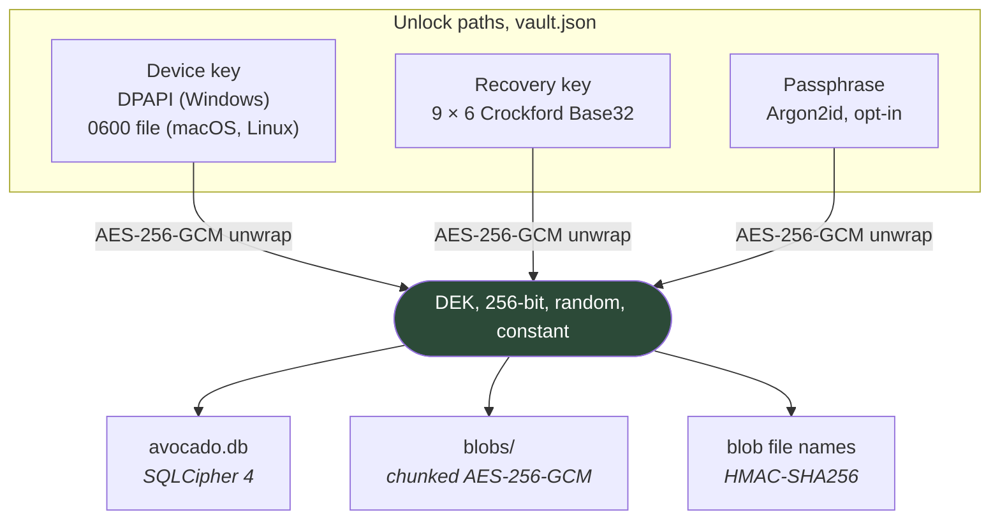

# Security

Avocado holds material covered by *secret professionnel*. This document states what it defends
against, what it does not, and how each defence is actually implemented, so that a reader can check
the claims rather than take them.

---

## Threat model

**What this defends against**

| Threat | Defence |
|---|---|
| A stolen or lost laptop | Everything **in the vault** is encrypted at rest and the device key is bound to the machine and the session. The documents in her own folders are the disk's problem, see below |
| A backup copied to a USB stick, a NAS or a cloud folder | The backup is the encrypted vault, documents included; without a key it is noise |
| Another process on the same machine reading the API | Per-launch bearer token, checked in constant time |
| A web page the user has open calling the local API | Same token, the port alone is not a boundary |
| A directory listing of `blobs/` confirming a document | Blob file names are `HMAC(DEK, sha256)`, not the plaintext hash |
| A corrupted or truncated encrypted file being read as plausible garbage | Chunk-authenticated AEAD with an authenticated index and final flag |
| A schema migration that succeeds and is wrong | A snapshot is taken first, always, and named in the failure message |
| A database silently written in plaintext | `PRAGMA cipher_version` asserted at every open |

**What this does not defend against, and says so plainly**

- **A compromised machine, open vault or not.** The data encryption key is in memory while it is
  unlocked, and the documents are plaintext in her own folders at all times. Nothing running as the
  user can be kept out; full-disk encryption is what covers the machine at rest.
- **An attacker who has both the machine and the recovery sheet.** That is the one combination with no
  way back, by design: there is no third copy of the key anywhere.
- **Physical access to an unlocked session.** There is no idle re-lock in v1.
- **A malicious build.** Verify the source and build it yourself; that is what the licence is for.

---

## Encryption at rest



**Envelope encryption.** One random 256-bit data encryption key encrypts everything and never changes.
`vault.json` holds one wrapped copy of it per unlock path. Enrolling a path, revoking one or changing
a passphrase rewrites that one file, no re-encryption, and no window during which the practice is
half-converted.

`vault.json` is **not secret**. It contains wrapped keys, salts and Argon2 parameters, all useless
without one of the unlock secrets.

### The relational data

SQLCipher 4, keyed by passing the raw DEK as a hex literal, not through the connection string, where
it would be a string in a pool key.

The dangerous failure here is silent, so it is checked rather than trusted: `VaultDatabase` asserts
`PRAGMA cipher_version` on every open, and refuses a file whose first sixteen bytes are the plaintext
SQLite header. The `Microsoft.EntityFrameworkCore.Sqlite.Core` package is used precisely because the
full one drags in `bundle_e_sqlite3`; with two bundles in a process the first to register wins, and if
that is plain SQLite then `PRAGMA key` is a no-op and everything is written in the clear with no error
at all.

### The documents

**They are no longer in the vault.** Ten lawyers refused an encrypted store they had to check files
out of, so a dossier now points at a folder of hers and Avocado reads it. On the machine, what protects
them is BitLocker or FileVault, which the application checks and reports rather than reimplements: see
`DiskEncryption`, which answers on macOS and Linux and answers « unknown » on Windows because the
authoritative check needs elevation. Never a guess in the reassuring direction.

**A backup still carries them.** Once a night, at an hour she sets, `FolderCapture` walks each
dossier's folder and writes what changed into the blob store below. The two are not in tension: she
works on plain files in Explorer, and Avocado keeps a copy it can give back. The copy those practices
keep today is a USB key holding the files in clear, so an encrypted one is strictly better than the
status quo, which is the whole argument for doing it.

A file whose size and last-write time match the manifest is not reopened, so only the first night
reads the practice. Files are opened `FileShare.ReadWrite`, because a document she has open in Word
is exactly the one worth backing up; what genuinely cannot be read is reported, never skipped
silently. A folder that is *absent* (an unplugged disk) is never mistaken for a folder that was
emptied: its rows and blobs are left alone.

`EncryptedBlobStore`: AES-256-GCM in 1 MB chunks, so a 50 MB scan is never fully resident in
plaintext. The nonce is a random per-blob prefix plus a chunk counter, reusing a (key, nonce) pair
with GCM is catastrophic, so it is derived, never generated twice. Each chunk authenticates its own
index and its flags, which is what makes truncation and reordering detectable rather than merely
unlikely.

**Chunks are deflated when it helps.** Compression is attempted on the first chunk and abandoned for
the rest of the file if it does not pay, so prose and `.msg` shrink and PDFs are left alone. The flag
saying so lives in the byte that already carried « final » and is covered by the AEAD's associated
data, so it cannot be flipped: a chunk cannot be made to inflate arbitrary bytes. A blob's identity
stays the SHA-256 of its *plaintext*, which keeps deduplication independent of the compressor.
Compressing before encrypting leaks a little about content through length; with no attacker-chosen
plaintext to mix in, that buys nothing that the file sizes in her folder do not already say.

**File names are `HMAC-SHA256(DEK, sha256(plaintext))`, not the plaintext hash.** Deduplication still
works, but a directory listing no longer lets anyone confirm *this vault contains this exact document*
by hashing a candidate file. The database is encrypted; the blob folder should not undo that.

---

## The unlock paths

### The device key

- **Windows:** DPAPI, scoped to the current user, with fixed extra entropy so an unrelated
  application's protected blob cannot be decrypted as one of ours, or the reverse. The protected blob
  is worthless on another machine or under another account, which is exactly the property wanted, and
  exactly why the recovery key is not optional.
- **macOS and Linux:** a machine key in a `0600` file in the user's config directory, **outside the
  vault folder**. A key stored beside the thing it unlocks is not a second factor. Keychain
  integration is a known gap.

### The recovery key

256 bits, rendered as nine dash-separated groups of six characters in **Crockford Base32**, no I, L,
O or U, so there is no 1/I or 0/O ambiguity and no accidental profanity. Decoding is case-insensitive,
ignores separators, folds the confusable letters back, and a two-character checksum catches the typos
that remain. It survives being read over the phone and typed off a printed sheet.

The setup wizard **will not let you past it** without printing it, exporting it, or writing it to a
removable drive. Réglages can check it, recopy two groups from your sheet, and issue a new one.

> Reissuing changes what future backups open with. Backups made before it still need the previous key;
> the interface says so in those words.

### The passphrase

Opt-in, Argon2id at 64 MiB / t=3 / p=4, comfortably above the OWASP floor, and about as far as a
pure-C# implementation can be pushed before unlocking takes seconds on a modest laptop. The parameters
are stored per key entry so they can be raised later without invalidating anything. It is a third
path, never a replacement for the other two.

---

## The local API

Binding to `127.0.0.1` **is not a security boundary**. Any process on the machine can reach the port,
and so can any page the user has open: the browser will send the cross-origin request, and a
DNS-rebinding page can read the reply.

The control is a **per-launch bearer token**, 32 random bytes, generated by the shell, passed to the
child in its environment, and never written to disk. `LocalApiTokenMiddleware` compares it in constant
time and answers `401` otherwise. Every response carries `X-Content-Type-Options: nosniff` and
`Cache-Control: no-store`.

The port is chosen by the OS and travels in the handshake, so there is nothing to guess and nothing to
collide with.

---

## The renderer

`contextIsolation: true`, `nodeIntegration: false`, `sandbox: true`. The preload exposes seven named
functions and nothing else, no general-purpose bridge, no `ipcRenderer` handed through. A bug in the
UI, or in anything it renders, cannot reach the filesystem, spawn a process or read the vault.

Content-Security-Policy, set on every response by the main process:

```
default-src 'self'; script-src 'self'; style-src 'self' 'unsafe-inline';
img-src 'self'; font-src 'self';
connect-src 'self' <backend> https://recherche-entreprises.api.gouv.fr;
object-src 'none'; frame-src 'none'
```

`style-src 'unsafe-inline'` is required by the bar chart, whose heights are percentages computed from
data. Nothing requires `img-src data:` any more: it existed for the recovery sheet's QR code, and the
QR was removed once it became clear nothing could read it.

Fonts are self-hosted and bundled (IBM Plex, OFL 1.1), so there is no CDN at runtime, which is what
makes the "nothing leaves this machine" claim checkable rather than merely stated.

---

## What leaves the machine

**One request, in the whole product.** Creating a *personne morale* can query
`recherche-entreprises.api.gouv.fr`, French open data, no key, no account, to fill in SIREN, legal
form and address.

It is constrained on every side:

- it fires only from the **third character**, never before;
- it sends **only what was typed in that one field**, never a dossier, a name or an identifier;
- it is made by the **renderer**, so the backend and the vault have no outbound capability at all;
- the form **states what leaves**, on the screen where it leaves;
- a switch turns it off entirely, no request is made, the field becomes plain text, and the word
  *annuaire* disappears from the interface.

Nothing else. No account, no telemetry, no crash reporting, no update check, no analytics.

---

## Documents in the clear

<a id="working-copies"></a>

**Every document this practice owns is plaintext on disk, all the time, and that is the design.**
There used to be a section here about working copies: files decrypted out of the vault so Word could
edit them, swept at launch, reconciled after a crash. All of it is gone, along with the store it
protected. Ten lawyers refused that arrangement, so a dossier now points at a folder of the user's
own and Avocado reads it.

What defends them is therefore not this application:

- **Full-disk encryption**, BitLocker or FileVault or LUKS, which is why `DiskEncryption` exists, why
  the setup wizard has a step for it, and why the answer on Windows is « unknown » rather than a
  reassuring guess (the authoritative check needs elevation).
- **The operating system's own permissions**, exactly as for every other file the user owns.

Avocado's contribution is narrower and worth stating precisely: **the copies it makes are encrypted
even though the originals are not.** The nightly capture writes each file into the blob store, so the
USB key, the external disk or the Drive folder holding the sauvegarde is unreadable without the
recovery key. The copy those practices keep today is a key carrying the files in clear; this is
strictly better than that, and it is the part Avocado can actually do.

Two consequences follow, and neither is hidden:

- Anything running as the user can read the documents. No application can prevent that.
- Avocado never writes into those folders except when explicitly asked: versing a pièce, and
  generating a modèle. Both refuse to overwrite an existing file.

---

## Refusals

The application refuses three things outright, and explains each rather than merely blocking it.

**A vault inside a synchronised folder.** A live SQLite database inside Dropbox, OneDrive or Google
Drive will eventually be corrupted, the client copies a file mid-write, and the WAL and the database
disagree. `CloudSyncDetector` walks up from the chosen folder looking for a sync root by name or by
the marker files those clients leave. It is best-effort and can be overridden, but the override is
quiet and right-aligned below the two real buttons: accepting the correction takes a click, overriding
takes a decision.

**Passing the recovery step without securing the key.** Printed, exported, copied to a removable
drive, or copied to the clipboard, one of them, or the gate stays shut.

**Migrating without a snapshot.** Every schema change writes `backups/<timestamp>-pre-migration.db`
first. SQLite DDL is transactional, so a migration that *fails* rolls itself back; the one that
succeeds and is wrong is the one nothing can undo.

---

## Known gaps

Stated because a security document that lists only its strengths is not one.

- **Backups have no screen yet.** The engine is built and scheduled: snapshots on a timer, an
  incremental mirror to any number of destinations, and a restore path that rebuilds a whole practice
  onto a new machine from the destination and the recovery key. What is missing is the interface, so
  today a destination has to be added over the API. Until that lands, the feature exists and nobody
  can reach it.
- **No native cloud connectors, and this one is a decision rather than a gap.** Drive, OneDrive and
  Dropbox are reached through the folder their desktop client keeps in sync, which to Avocado is a
  folder like any other. Talking to Drive's own API would need an OAuth client owned by a Google
  Cloud project, putting somebody's legal identity on a consent screen shown to other people's
  clients, and no solo practice will create one for itself. The trade is real: it needs the desktop
  client installed. What it buys is no credentials shipped in an open-source binary, no token
  storage, nothing to renew, and no third party to trust with an authorisation.
- **No Keychain on macOS**, no Secret Service on Linux: a `0600` file stands in for both.
- **No idle re-lock.** An unlocked session stays unlocked until the application closes.
- **No audit trail.** Who changed what, and when, is not recorded beyond `CreatedAt` and `UpdatedAt`.
- **The blob store is never swept.** A document edited today leaves yesterday's version stored
  forever, locally and on every destination. That is what makes an old snapshot genuinely restorable,
  and it is unbounded: expect roughly a gigabyte a year of superseded versions against a practice of
  twelve. Reclaiming it means computing the live set across every retained snapshot, and getting that
  wrong deletes client documents, so it is deliberately not done yet.
- **`InvariantGlobalization` is on** in the backend, so French month and date formatting is done by
  the renderer. This is a deliberate size trade-off, not an oversight.

---

## Reporting a vulnerability

Open an issue for anything already public. For anything that is not, contact the maintainer privately
first, this software holds other people's confidential files, and a disclosure window matters more
here than the credit for finding it.
