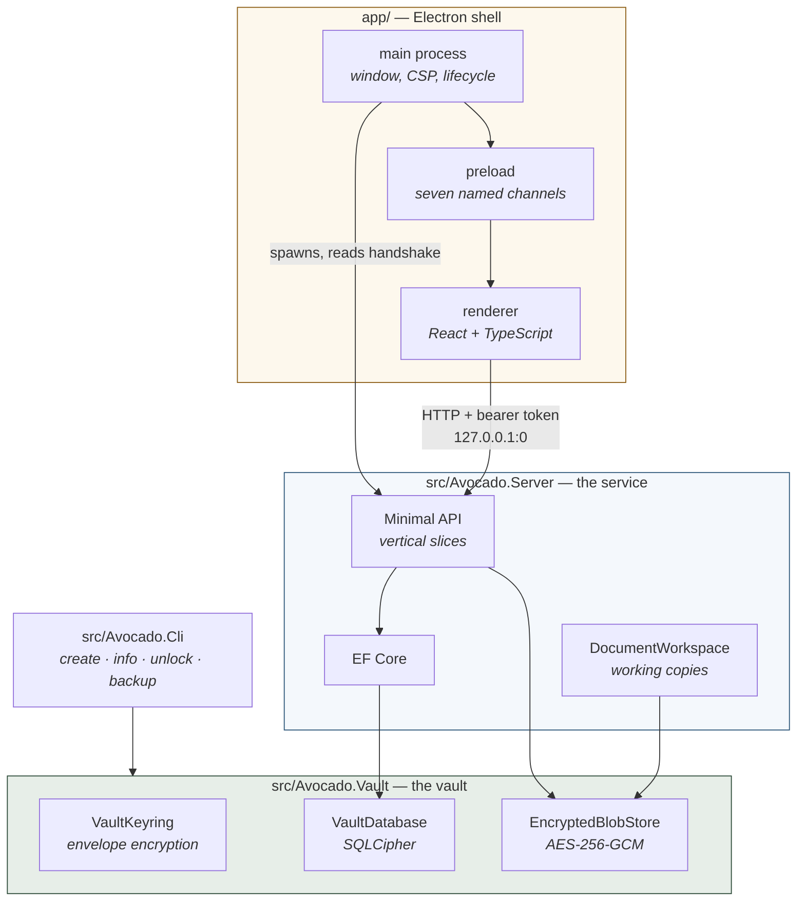
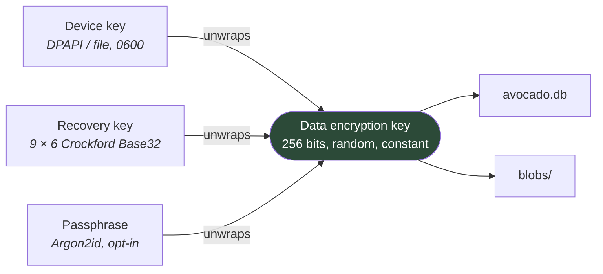
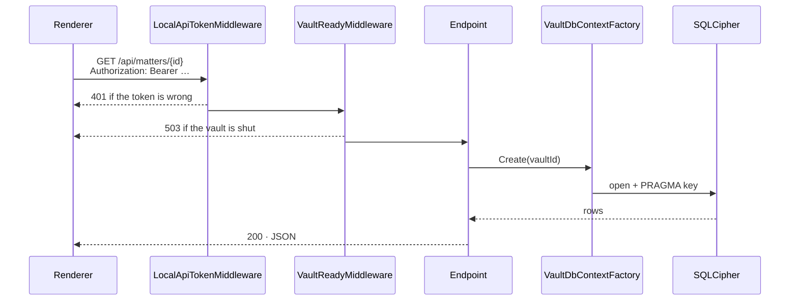
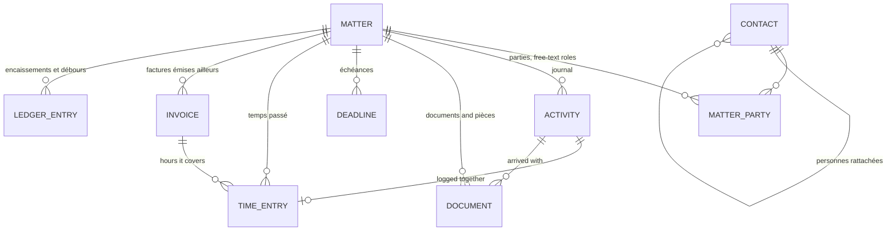

# Architecture

Avocado is a desktop application that behaves like a local web application, because that is the
cheapest way to keep it honest. A shell owns the window, a service owns the domain, and a library
owns the encryption. Nothing crosses those lines except over an HTTP API and one file format.

Read this first; [backend.md](backend.md), [frontend.md](frontend.md) and [security.md](security.md)
go one level down each.

---

## The three projects



| Project | Responsibility | Knows about |
|---|---|---|
| `Avocado.Vault` | Encryption at rest, keys, blobs, backups | Nothing above it |
| `Avocado.Server` | The domain, the API, the schema | The vault |
| `Avocado.Cli` | Operations on a vault without a UI | The vault |
| `app/` | A window, and drawing the API's answers | The API's shape only |

The dependency arrows only ever point downwards. `Avocado.Vault` has no idea what a *dossier* is, and
the shell has no idea what SQLCipher is.

---

## Why a local HTTP service rather than one process

An Electron application that talks to SQLite directly is one process and no ceremony. Avocado does not
do that, for three reasons that were worth the cost:

1. **The domain is testable without a window.** Every rule about billing, deadlines and exhibits lives
   in C# and is exercised by `dotnet test`, not by driving a UI.
2. **The shell is replaceable.** It holds no business logic. Swapping Electron for something else, or
   adding a hosted deployment, changes one folder and no rules.
3. **Multi-tenancy is already there and costs nothing.** Every slice asks for a database *by vault
   id*; on the desktop every id resolves to the single open vault. A hosted Avocado would change
   `VaultSession` and nothing else.

The price is a spawned process and a handshake, both of which are about fifty lines in
[`backend.ts`](../app/electron/backend.ts).

---

## Vertical slices

`src/Avocado.Server/Features/` has one folder per slice — `Matters`, `Activities`, `Documents`,
`Billings`, `Templates` — and a slice owns its entity, its DTOs, its endpoints and its EF
configuration. There is no `Services/`, no `Repositories/`, no MediatR.

```
Features/Billings/
  BillingInvoice.cs            entity
  BillingLedgerEntry.cs        entity
  BillingSummaryQuery.cs       the one place « reste à facturer » is computed
  Endpoints/
    BillingEndpoints.cs        routing only
    CreateInvoice.cs           one file per endpoint
    BillTimeEntries.cs
    ExportBillingDetail.cs
    Dtos/
  Infrastructure/              IEntityTypeConfiguration, collected by assembly scan
  ValueObjects/
  Enums/
```

Conventions, applied everywhere:

- **Namespaces are plural** (`Billings`, not `Billing`) and follow the folder.
- **Types are prefixed by the slice in the singular** (`BillingLedgerEntry`, not `LedgerEntry`), so a
  name is unambiguous the moment you read it in another slice.
- **One file per endpoint.** Vertical slices do not mean one enormous file.
- A figure that appears on two screens is computed in **one** place — `BillingSummaryQuery`,
  `DeadlineUrgencyRule`, `MatterTouch` — because a second implementation eventually disagrees with the
  first.

The one thing that cannot be sliced is the `DbContext`; it stays central and collects each slice's
configuration by assembly scan.

---

## The vault on disk

```
<coffre>/
  vault.json      the keyring: one wrapped DEK per unlock path. Not secret by itself.
  avocado.db      SQLCipher. Everything relational: dossiers, journal, temps, factures.
  blobs/          one encrypted file per document, content-addressed
  backups/        snapshots, including the automatic pre-migration ones
```

Working copies — files currently open in Word — deliberately live **outside** the vault, in the
platform's machine-local application-state folder. See [security.md](security.md#working-copies).



Envelope encryption: one data encryption key encrypts everything and **never changes**; `vault.json`
holds the list of ways to unwrap it. Enrolling a new unlock path, revoking one, or changing the
passphrase rewrites that file and nothing else — no re-encryption of the practice, and no downtime.
It is also what will let a second user be added without touching a single blob.

---

## A request, end to end



Two middlewares and nothing else. The token is checked in constant time; the vault-ready check exists
because the application has to run *before* a vault exists — the setup wizard is served by the same
service.

---

## Data model



Three decisions worth knowing before reading the code:

- **Status is derived, never stored.** A dossier is *en cours* while `ClosedOn` is null. There is no
  status column to fall out of step with reality.
- **A pièce is a document** that has been given a number and a libellé — two nullable columns, not a
  second table. The relationship is 1:1 by definition.
- **Money is `long` cents, everywhere.** SQLite has no decimal type; EF stores decimals as text and
  `ORDER BY amount` then sorts lexicographically. `AvocadoDbContext` **throws at model-building time**
  if any property is a `decimal`, so reintroducing one is a build failure rather than a subtly wrong
  total.

Timestamps are `DateTimeOffset` stored as ISO-8601 UTC text through `UtcTimestampConverter` — sortable
as text, and legible when you open the database with a tool.

---

## Where to look for what

| Question | File |
|---|---|
| How is « reste à facturer » computed? | `Features/Billings/BillingSummaryQuery.cs` |
| Which urgency tier is a deadline in? | `Features/Deadlines/DeadlineUrgencyRule.cs` |
| What counts as « touching » a dossier? | `Features/Matters/MatterTouch.cs` |
| How does a document get into Word and back? | `Features/Documents/Workspace/DocumentWorkspace.cs` |
| Where is the encryption? | `Avocado.Vault/Keys/VaultKeyring.cs`, `Blobs/EncryptedBlobStore.cs` |
| Why is the schema migrated the way it is? | `Data/VaultMigrator.cs` |
